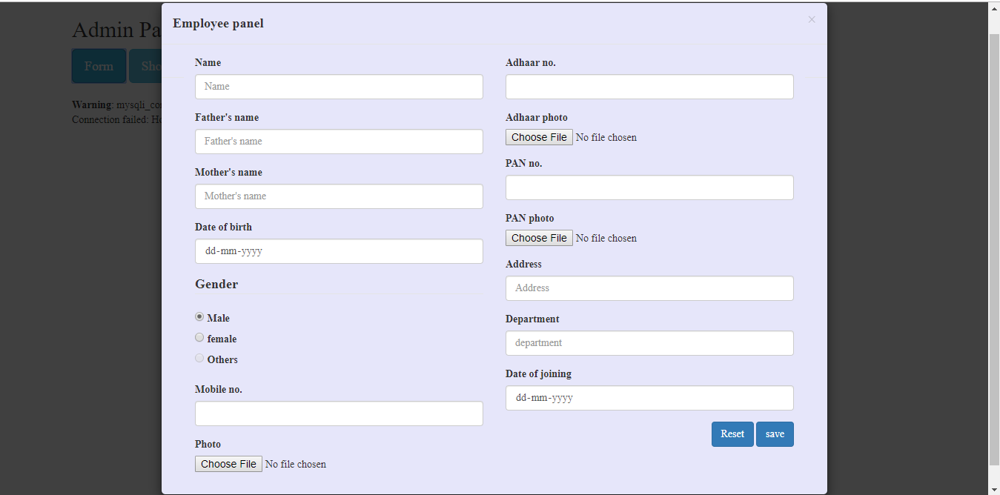

<h1 align="center">Employment-Detail-Form---PHP</h1>

I built a Employee Detail Online Form which can be used by the companies to keep the details of their employees.
The Project contains the two Panels-
- Admin Panel(for the Company)  
- Employee Form(for the employees)

The language used-
- Back-end languages like php, python etc.
- Front-end languages like Ajax, jQuery, Html, Css etc.
- Database - phpMyAdmin, MySQL. 
- Software Used (Server) - Xampp(Windows), VS Code(IDE).

---

## Screenshots

